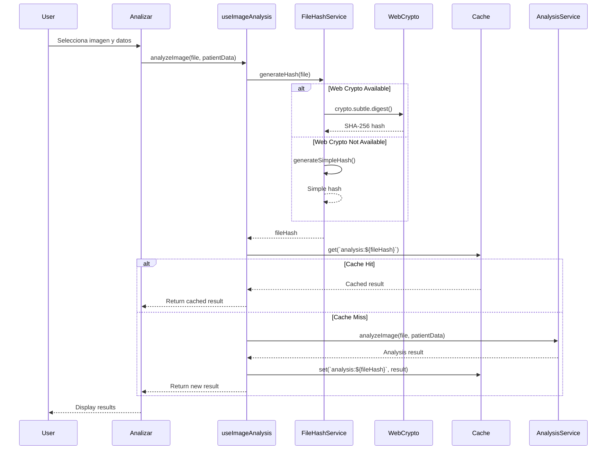

# Design Document - Sistema Robusto de Hash de Archivos

## Overview

Este documento describe el diseño de un sistema robusto de generación de hash de archivos que funciona de manera confiable en diferentes contextos de navegador, incluyendo conexiones HTTP/HTTPS y dispositivos con diferentes capacidades de API Web Crypto. La solución implementa un patrón de fallback automático que garantiza la funcionalidad del sistema de análisis de imágenes independientemente del entorno del usuario.

## Architecture

### High-Level Architecture

```
┌─────────────────────────────────────────────────────────────┐
│                    useImageAnalysis Hook                     │
│  ┌───────────────────────────────────────────────────────┐  │
│  │         analyzeImage(file, patientData)               │  │
│  └───────────────────┬───────────────────────────────────┘  │
│                      │                                       │
│                      ▼                                       │
│  ┌───────────────────────────────────────────────────────┐  │
│  │           FileHashService.generateHash()              │  │
│  │                                                        │  │
│  │  ┌──────────────────────────────────────────────┐    │  │
│  │  │  1. Check crypto.subtle availability         │    │  │
│  │  │  2. Try Web Crypto API (SHA-256)             │    │  │
│  │  │  3. Fallback to simple hash if fails         │    │  │
│  │  └──────────────────────────────────────────────┘    │  │
│  └───────────────────┬───────────────────────────────────┘  │
│                      │                                       │
│                      ▼                                       │
│  ┌───────────────────────────────────────────────────────┐  │
│  │              Cache System (apiCache)                  │  │
│  │         Key: `analysis:${fileHash}`                   │  │
│  └───────────────────────────────────────────────────────┘  │
└─────────────────────────────────────────────────────────────┘
```

### Component Interaction Flow



## Components and Interfaces

### 1. FileHashService (Nuevo Componente)

**Ubicación:** `oncoderma-frontend/src/utils/fileHashService.js`

**Responsabilidad:** Generar hashes únicos de archivos usando el mejor método disponible.

**Interface:**

```javascript
class FileHashService {
  /**
   * Verifica si Web Crypto API está disponible
   * @returns {boolean}
   */
  isWebCryptoAvailable(): boolean

  /**
   * Genera hash usando Web Crypto API (SHA-256)
   * @param {File} file - Archivo a hashear
   * @returns {Promise<string>} Hash hexadecimal
   * @throws {Error} Si Web Crypto no está disponible o falla
   */
  generateCryptoHash(file: File): Promise<string>

  /**
   * Genera hash simple basado en propiedades del archivo
   * @param {File} file - Archivo a hashear
   * @returns {Promise<string>} Hash simple
   */
  generateSimpleHash(file: File): Promise<string>

  /**
   * Genera hash con fallback automático
   * @param {File} file - Archivo a hashear
   * @returns {Promise<{hash: string, method: 'crypto'|'simple'}>}
   */
  generateHash(file: File): Promise<{hash: string, method: string}>
}
```

**Implementación del Hash Simple:**

El hash simple se basará en:
- Nombre del archivo
- Tamaño del archivo (bytes)
- Tipo MIME
- Última fecha de modificación
- Primeros y últimos bytes del archivo (muestra)

```javascript
generateSimpleHash(file) {
  // Combinar propiedades del archivo
  const props = `${file.name}-${file.size}-${file.type}-${file.lastModified}`
  
  // Leer muestra de bytes del inicio y final
  const reader = new FileReader()
  const blob = file.slice(0, 1024) // Primeros 1KB
  const blobEnd = file.slice(-1024) // Últimos 1KB
  
  // Generar hash simple usando algoritmo de string hash
  return simpleStringHash(props + sampleBytes)
}

// Algoritmo de hash de string (djb2)
function simpleStringHash(str) {
  let hash = 5381
  for (let i = 0; i < str.length; i++) {
    hash = ((hash << 5) + hash) + str.charCodeAt(i)
  }
  return hash.toString(16).padStart(16, '0')
}
```

### 2. useImageAnalysis Hook (Modificado)

**Ubicación:** `oncoderma-frontend/src/hooks/useImageAnalysis.js`

**Cambios:**

```javascript
import { FileHashService } from '../utils/fileHashService'

const fileHashService = new FileHashService()

const analyzeImage = useCallback(async (file, patientData = null) => {
  // ... validaciones ...

  try {
    // Generar hash con fallback automático
    const { hash: fileHash, method } = await fileHashService.generateHash(file)
    fileHashRef.current = fileHash
    
    console.log(`Hash generado usando método: ${method}`)
    
    // Verificar caché
    const cachedResult = cache.get(`analysis:${fileHash}`)
    if (cachedResult) {
      console.log('Usando resultado desde caché')
      // ... retornar resultado cacheado ...
    }
    
    // ... continuar con análisis ...
    
  } catch (hashError) {
    // Si falla el hash, continuar sin caché
    console.warn('No se pudo generar hash, continuando sin caché:', hashError)
    fileHashRef.current = null
  }
  
  // ... resto del análisis ...
}, [])
```

### 3. AnalysisService (Modificado)

**Ubicación:** `oncoderma-frontend/src/services/analysisService.js`

**Cambios:**

```javascript
import { FileHashService } from '../utils/fileHashService'

class AnalysisService {
  constructor() {
    // ... configuración existente ...
    this.fileHashService = new FileHashService()
  }

  // Eliminar el método generateFileHash actual
  // Ya no se usa directamente aquí
  
  async analyzeImage(file, options = {}) {
    // El hash ahora se genera en useImageAnalysis
    // Este servicio solo se encarga del análisis real
    // ... implementación existente sin cambios en la lógica de hash ...
  }
}
```

## Data Models

### HashResult

```typescript
interface HashResult {
  hash: string          // Hash generado (hexadecimal)
  method: 'crypto' | 'simple'  // Método usado
  timestamp: number     // Timestamp de generación
}
```

### FileHashMetadata

```typescript
interface FileHashMetadata {
  fileName: string
  fileSize: number
  fileType: string
  lastModified: number
  sampleBytes?: string  // Muestra de bytes (solo para simple hash)
}
```

## Error Handling

### Estrategia de Manejo de Errores

1. **Web Crypto No Disponible:**
   - Detectar antes de intentar usar
   - Usar automáticamente método simple
   - Registrar en consola para debugging

2. **Error en Generación de Hash:**
   - Intentar método alternativo
   - Si ambos fallan, continuar sin caché
   - No interrumpir el flujo de análisis

3. **Error en Lectura de Archivo:**
   - Capturar errores de FileReader
   - Retornar hash basado solo en metadatos
   - Registrar error para debugging

### Código de Manejo de Errores

```javascript
async generateHash(file) {
  try {
    // Intentar Web Crypto primero
    if (this.isWebCryptoAvailable()) {
      try {
        const hash = await this.generateCryptoHash(file)
        return { hash, method: 'crypto' }
      } catch (cryptoError) {
        console.warn('Web Crypto falló, usando fallback:', cryptoError.message)
      }
    }
    
    // Fallback a hash simple
    const hash = await this.generateSimpleHash(file)
    return { hash, method: 'simple' }
    
  } catch (error) {
    console.error('Error generando hash:', error)
    // Último recurso: hash basado solo en metadatos
    const fallbackHash = this.generateMetadataHash(file)
    return { hash: fallbackHash, method: 'metadata' }
  }
}
```

## Testing Strategy

### Unit Tests

**FileHashService Tests:**

```javascript
describe('FileHashService', () => {
  describe('isWebCryptoAvailable', () => {
    it('should return true when crypto.subtle is available')
    it('should return false when crypto.subtle is undefined')
  })
  
  describe('generateCryptoHash', () => {
    it('should generate SHA-256 hash for valid file')
    it('should generate same hash for same file')
    it('should generate different hash for different files')
    it('should throw error when crypto.subtle is not available')
  })
  
  describe('generateSimpleHash', () => {
    it('should generate hash based on file properties')
    it('should generate same hash for same file')
    it('should generate different hash for different files')
    it('should work without crypto.subtle')
  })
  
  describe('generateHash', () => {
    it('should use crypto method when available')
    it('should fallback to simple method when crypto fails')
    it('should return hash and method used')
    it('should handle file read errors gracefully')
  })
})
```

### Integration Tests

```javascript
describe('useImageAnalysis with FileHashService', () => {
  it('should cache results using crypto hash')
  it('should cache results using simple hash')
  it('should retrieve cached results correctly')
  it('should continue analysis if hash generation fails')
})
```

### Manual Testing Scenarios

1. **Escenario HTTPS (localhost):**
   - Verificar que usa Web Crypto API
   - Verificar que el caché funciona correctamente

2. **Escenario HTTP (red local):**
   - Verificar que usa hash simple automáticamente
   - Verificar que el análisis funciona sin errores
   - Verificar que el caché funciona con hash simple

3. **Escenario Navegador Antiguo:**
   - Simular navegador sin Web Crypto API
   - Verificar fallback automático
   - Verificar funcionalidad completa

## Performance Considerations

### Web Crypto API (SHA-256)
- **Tiempo:** ~5-20ms para archivos de 1-5MB
- **Ventajas:** Hash criptográficamente seguro, único
- **Desventajas:** Solo disponible en contextos seguros

### Simple Hash
- **Tiempo:** ~2-10ms para archivos de 1-5MB
- **Ventajas:** Funciona en cualquier contexto, rápido
- **Desventajas:** Menos único, posibles colisiones

### Optimizaciones

1. **Caché de Disponibilidad:**
   ```javascript
   // Cachear resultado de isWebCryptoAvailable
   let webCryptoAvailable = null
   
   isWebCryptoAvailable() {
     if (webCryptoAvailable === null) {
       webCryptoAvailable = typeof crypto !== 'undefined' && 
                           typeof crypto.subtle !== 'undefined'
     }
     return webCryptoAvailable
   }
   ```

2. **Lectura Parcial de Archivos:**
   ```javascript
   // Solo leer muestras del archivo, no todo
   const sampleSize = 1024 // 1KB
   const startSample = file.slice(0, sampleSize)
   const endSample = file.slice(-sampleSize)
   ```

3. **Lazy Loading:**
   ```javascript
   // Cargar FileHashService solo cuando se necesita
   const fileHashService = lazy(() => import('./fileHashService'))
   ```

## Security Considerations

### Hash Collisions

**Riesgo:** Dos archivos diferentes podrían generar el mismo hash simple.

**Mitigación:**
- Incluir múltiples propiedades del archivo
- Incluir muestras de bytes del contenido
- Usar timestamp de última modificación
- Aceptar que el caché puede tener colisiones mínimas (no crítico)

### Privacy

**Consideración:** Los hashes no deben exponer información sensible.

**Implementación:**
- No incluir información del paciente en el hash
- Solo usar propiedades del archivo
- No enviar hashes al servidor

### Content Integrity

**Consideración:** Verificar que el archivo no ha sido modificado.

**Implementación:**
- El hash cambia si el archivo cambia
- Caché se invalida automáticamente
- No hay riesgo de usar resultados incorrectos

## Browser Compatibility

### Supported Browsers

| Browser | Web Crypto API | Simple Hash | Status |
|---------|---------------|-------------|--------|
| Chrome 60+ | ✅ | ✅ | Full Support |
| Firefox 55+ | ✅ | ✅ | Full Support |
| Safari 11+ | ✅ | ✅ | Full Support |
| Edge 79+ | ✅ | ✅ | Full Support |
| Chrome Mobile | ✅ (HTTPS only) | ✅ | Full Support |
| Safari iOS | ✅ (HTTPS only) | ✅ | Full Support |

### Fallback Strategy

```
1. Try Web Crypto API (SHA-256)
   ↓ (if fails or unavailable)
2. Try Simple Hash (file properties + samples)
   ↓ (if fails)
3. Metadata Hash (file properties only)
   ↓ (if fails)
4. Continue without cache
```

## Migration Strategy

### Phase 1: Implementar FileHashService
- Crear nuevo servicio con ambos métodos
- Agregar tests unitarios
- No integrar aún

### Phase 2: Integrar en useImageAnalysis
- Reemplazar llamada directa a crypto.subtle
- Agregar manejo de errores
- Mantener funcionalidad existente

### Phase 3: Actualizar AnalysisService
- Remover método generateFileHash duplicado
- Usar FileHashService si es necesario
- Limpiar código redundante

### Phase 4: Testing y Validación
- Probar en localhost (HTTPS)
- Probar en red local (HTTP)
- Probar en diferentes navegadores
- Validar caché funciona correctamente

## Monitoring and Logging

### Logs de Debugging

```javascript
// En FileHashService
console.log(`[FileHash] Método usado: ${method}`)
console.log(`[FileHash] Hash generado: ${hash.substring(0, 8)}...`)

// En useImageAnalysis
console.log(`[Analysis] Hash del archivo: ${fileHash}`)
console.log(`[Analysis] Resultado desde caché: ${fromCache}`)

// Métricas de rendimiento
console.time('hash-generation')
const hash = await generateHash(file)
console.timeEnd('hash-generation')
```

### Error Tracking

```javascript
// Registrar errores pero no interrumpir flujo
try {
  const hash = await generateHash(file)
} catch (error) {
  console.error('[FileHash] Error:', {
    message: error.message,
    fileName: file.name,
    fileSize: file.size,
    webCryptoAvailable: isWebCryptoAvailable()
  })
  // Continuar sin caché
}
```

## Future Enhancements

1. **IndexedDB para Caché Persistente:**
   - Almacenar hashes y resultados en IndexedDB
   - Sobrevivir a recargas de página
   - Mayor capacidad de almacenamiento

2. **Web Workers para Hash:**
   - Mover generación de hash a Web Worker
   - No bloquear UI thread
   - Mejor performance en archivos grandes

3. **Progressive Hash:**
   - Generar hash mientras se sube el archivo
   - Reducir tiempo de espera percibido
   - Mejor UX

4. **Hash Verification:**
   - Verificar integridad del archivo antes de análisis
   - Detectar archivos corruptos
   - Mejor confiabilidad

## Conclusion

Este diseño proporciona una solución robusta y compatible para la generación de hash de archivos en diferentes contextos de navegador. La estrategia de fallback automático garantiza que el sistema de análisis de imágenes funcione correctamente independientemente del protocolo de conexión (HTTP/HTTPS) o las capacidades del navegador del usuario.

La implementación es:
- **Robusta:** Múltiples niveles de fallback
- **Compatible:** Funciona en todos los navegadores modernos
- **Performante:** Optimizada para archivos de imagen típicos
- **Mantenible:** Código limpio y bien documentado
- **Testeable:** Fácil de probar en diferentes escenarios
