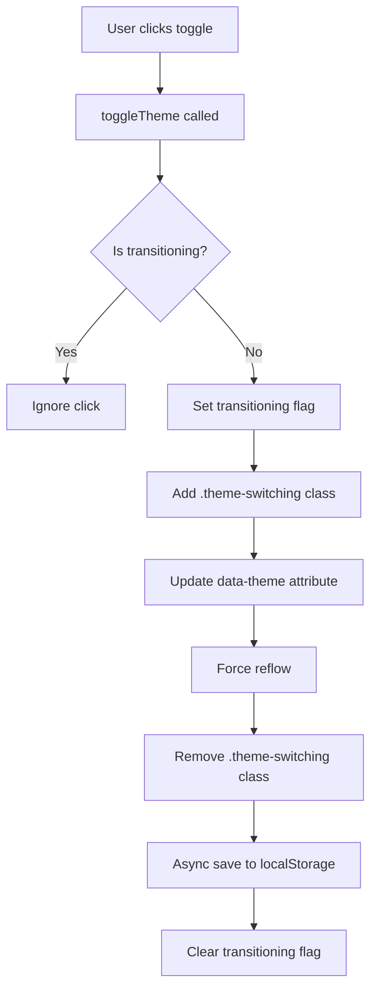

# Design Document - Theme Toggle Performance Optimization

## Overview

This design addresses the lag issue in the theme toggle functionality by consolidating multiple theme implementations, optimizing DOM updates, and implementing performance best practices. The solution will provide instant visual feedback (<16ms) while maintaining smooth transitions.

### Current Issues Identified

1. **Multiple Theme Implementations**: Three separate theme context files exist:
   - `contexts/ThemeContext.jsx` (basic, currently used by Navbar)
   - `hooks/useTheme.jsx` (intermediate)
   - `hooks/useOptimizedTheme.jsx` (optimized but not used)

2. **Performance Bottlenecks**:
   - No CSS transition disabling during theme switch
   - Synchronous localStorage writes blocking UI thread
   - No debouncing for rapid clicks
   - Excessive re-renders due to context updates

3. **CSS Issues**:
   - Global `*` selector with transitions causes layout thrashing
   - No `will-change` hints for browser optimization
   - Transitions applied to all properties unnecessarily

## Architecture

### Component Structure

```
ThemeProvider (Single Source of Truth)
├── useTheme hook (optimized)
├── Theme persistence (async)
└── DOM updates (batched)
    ├── Navbar (theme toggle button)
    ├── App (root theme application)
    └── All themed components
```

### Data Flow



## Components and Interfaces

### 1. Optimized Theme Context

**File**: `src/contexts/ThemeContext.jsx` (consolidated)

**API**:
```javascript
interface ThemeContextValue {
  theme: 'light' | 'dark'
  toggleTheme: () => void
  setLightTheme: () => void
  setDarkTheme: () => void
  isDark: boolean
  isLight: boolean
  isTransitioning: boolean
}
```

**Key Features**:
- Single source of truth for theme state
- Debounced toggle with 100ms delay
- Transition lock to prevent race conditions
- Async localStorage persistence
- Memoized context value to prevent unnecessary re-renders

### 2. Theme Toggle Button Component

**Location**: `src/components/Navbar.jsx` (updated)

**Optimizations**:
- Disabled state during transitions
- Visual feedback within 50ms
- Touch-friendly sizing (44x44px minimum)
- Prevent double-tap zoom on mobile
- Icon updates without animation delay

### 3. CSS Optimization Layer

**File**: `src/index.css` (updated)

**Changes**:
1. Add `.theme-switching` class to disable transitions
2. Replace global `*` selector with specific selectors
3. Add `will-change` hints for theme-dependent properties
4. Use CSS containment for isolated components

## Data Models

### Theme State

```typescript
interface ThemeState {
  current: 'light' | 'dark'
  isTransitioning: boolean
  transitionTimeout: NodeJS.Timeout | null
}
```

### Theme Persistence

```typescript
interface ThemeStorage {
  key: 'oncoderma-theme'
  value: 'light' | 'dark'
  storage: localStorage
  async: true
}
```

## Implementation Details

### 1. Transition Optimization

**Problem**: Global transitions cause layout thrashing during theme switch

**Solution**: Temporarily disable transitions during theme change

```css
/* Disable all transitions during theme switch */
.theme-switching,
.theme-switching * {
  transition: none !important;
  animation: none !important;
}

/* Optimize specific properties with will-change */
:root {
  will-change: background-color;
}

body {
  will-change: background-color, color;
}

.card, .metric-card, .btn-primary, .btn-secondary {
  will-change: background-color, border-color, box-shadow;
}
```

### 2. Debounced Toggle Implementation

**Problem**: Rapid clicks cause multiple state updates

**Solution**: Debounce with 100ms delay and transition lock

```javascript
const toggleTheme = useCallback(() => {
  // Prevent clicks during transition
  if (isTransitioningRef.current) return
  
  // Clear any pending toggle
  if (debounceTimeoutRef.current) {
    clearTimeout(debounceTimeoutRef.current)
  }
  
  // Debounce the actual toggle
  debounceTimeoutRef.current = setTimeout(() => {
    isTransitioningRef.current = true
    setTheme(prev => prev === 'light' ? 'dark' : 'light')
  }, 100)
}, [])
```

### 3. Optimized DOM Updates

**Problem**: Multiple DOM operations cause reflows

**Solution**: Batch updates using requestAnimationFrame

```javascript
const applyTheme = useCallback((newTheme) => {
  const root = document.documentElement
  
  // Step 1: Disable transitions
  root.classList.add('theme-switching')
  
  // Step 2: Apply theme (batched)
  requestAnimationFrame(() => {
    root.setAttribute('data-theme', newTheme)
    
    // Update meta tag for mobile
    const metaThemeColor = document.querySelector('meta[name="theme-color"]')
    if (metaThemeColor) {
      metaThemeColor.setAttribute(
        'content',
        newTheme === 'dark' ? '#0c1220' : '#f1f5f9'
      )
    }
    
    // Step 3: Force reflow
    root.offsetHeight
    
    // Step 4: Re-enable transitions
    requestAnimationFrame(() => {
      root.classList.remove('theme-switching')
      isTransitioningRef.current = false
    })
  })
}, [])
```

### 4. Async Storage Persistence

**Problem**: Synchronous localStorage writes block UI thread

**Solution**: Use async pattern with queueMicrotask

```javascript
const persistTheme = useCallback((theme) => {
  queueMicrotask(() => {
    try {
      localStorage.setItem('oncoderma-theme', theme)
    } catch (error) {
      console.warn('Failed to persist theme:', error)
    }
  })
}, [])
```

### 5. Context Optimization

**Problem**: Context updates cause unnecessary re-renders

**Solution**: Memoize context value and use refs for transient state

```javascript
const value = useMemo(() => ({
  theme,
  toggleTheme,
  setLightTheme,
  setDarkTheme,
  isDark: theme === 'dark',
  isLight: theme === 'light',
  isTransitioning: isTransitioningRef.current
}), [theme, toggleTheme, setLightTheme, setDarkTheme])
```

## Error Handling

### 1. localStorage Failures

```javascript
try {
  localStorage.setItem('oncoderma-theme', theme)
} catch (error) {
  // Quota exceeded or private browsing
  console.warn('Theme persistence failed:', error)
  // Continue with in-memory theme
}
```

### 2. Missing DOM Elements

```javascript
const metaThemeColor = document.querySelector('meta[name="theme-color"]')
if (metaThemeColor) {
  // Safe to update
  metaThemeColor.setAttribute('content', color)
}
```

### 3. Concurrent Toggle Attempts

```javascript
if (isTransitioningRef.current) {
  // Silently ignore - no error needed
  return
}
```

## Testing Strategy

### 1. Performance Testing

**Metrics to Measure**:
- Time from click to visual change (target: <16ms)
- Frame rate during transition (target: 60fps)
- Memory usage during rapid toggles
- CPU usage during theme switch

**Tools**:
- Chrome DevTools Performance tab
- React DevTools Profiler
- Lighthouse performance audit

### 2. Functional Testing

**Test Cases**:
1. Single toggle switches theme correctly
2. Rapid clicks don't cause race conditions
3. Theme persists across page reloads
4. System preference detection works
5. Mobile touch targets are adequate (44x44px)
6. Keyboard navigation works (Enter/Space)
7. Theme applies to all components

### 3. Cross-Browser Testing

**Browsers**:
- Chrome/Edge (Chromium)
- Firefox
- Safari (desktop and mobile)
- Mobile browsers (iOS Safari, Chrome Android)

### 4. Accessibility Testing

**Checks**:
- ARIA labels present
- Keyboard navigation functional
- Screen reader announces theme change
- Focus visible during keyboard navigation
- Reduced motion preference respected

## Performance Optimizations

### 1. CSS Optimizations

```css
/* Use CSS containment for isolated components */
.card {
  contain: layout style paint;
}

/* Optimize transition properties */
.btn-primary {
  transition: background-color 0.2s ease, 
              box-shadow 0.2s ease,
              transform 0.2s ease;
  /* Don't transition all properties */
}

/* Use transform instead of position changes */
.hover-lift:hover {
  transform: translateY(-4px); /* GPU accelerated */
  /* Instead of: top: -4px; */
}
```

### 2. React Optimizations

```javascript
// Memoize expensive computations
const themeColors = useMemo(() => ({
  background: theme === 'dark' ? '#0c1220' : '#f1f5f9',
  text: theme === 'dark' ? '#f8fafc' : '#0f172a'
}), [theme])

// Use refs for transient state
const isTransitioningRef = useRef(false)

// Prevent unnecessary re-renders
const MemoizedNavbar = memo(Navbar)
```

### 3. Mobile Optimizations

```css
/* Prevent double-tap zoom on toggle button */
.theme-toggle {
  touch-action: manipulation;
  -webkit-tap-highlight-color: transparent;
}

/* Optimize for mobile performance */
@media (max-width: 768px) {
  * {
    transition-duration: 0.2s; /* Faster on mobile */
  }
}
```

## Migration Plan

### Phase 1: Consolidation
1. Keep `contexts/ThemeContext.jsx` as the single source
2. Delete `hooks/useTheme.jsx`
3. Delete `hooks/useOptimizedTheme.jsx`
4. Update all imports to use `contexts/ThemeContext`

### Phase 2: Optimization
1. Add transition disabling CSS
2. Implement debounced toggle
3. Add async storage persistence
4. Optimize context value memoization

### Phase 3: Testing
1. Performance profiling
2. Cross-browser testing
3. Mobile device testing
4. Accessibility audit

### Phase 4: Cleanup
1. Remove unused theme-related code
2. Update documentation
3. Add performance monitoring

## Monitoring and Metrics

### Key Performance Indicators

1. **Theme Switch Time**: <16ms (1 frame at 60fps)
2. **Frame Rate**: Maintain 60fps during transition
3. **Memory**: No memory leaks from rapid toggles
4. **User Satisfaction**: No reported lag issues

### Monitoring Implementation

```javascript
// Performance monitoring
const measureThemeSwitch = () => {
  const start = performance.now()
  
  toggleTheme()
  
  requestAnimationFrame(() => {
    const end = performance.now()
    const duration = end - start
    
    if (duration > 16) {
      console.warn(`Theme switch took ${duration}ms (target: <16ms)`)
    }
  })
}
```

## Future Enhancements

1. **Smooth Color Transitions**: Implement CSS `@starting-style` for smoother color transitions (when browser support improves)
2. **Theme Presets**: Allow users to customize theme colors
3. **Auto Theme Switching**: Based on time of day
4. **Theme Animation Options**: Let users choose transition style
5. **Performance Dashboard**: Real-time performance metrics for theme switching
